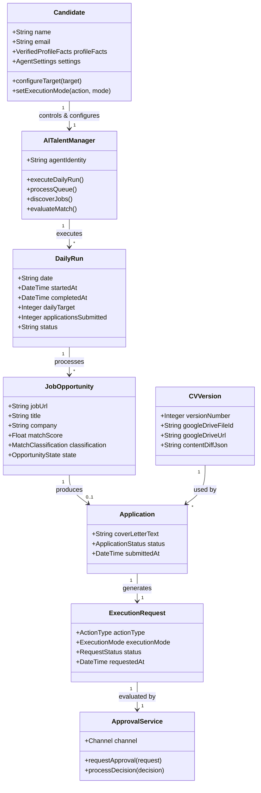

# Domain Model — ai-talent-manager

## Key Domain Concepts & Entities

### 1. Actors & Control Model
- **Candidate (System Owner)**: Authoritative source of verified career facts. Controls settings, sets daily application targets, and approves execution requests.
- **AI Talent Manager (Agent)**: Explicitly disclosed AI identity acting on behalf of candidate. Orchestrates daily runs, discovery, queueing, tailoring, and outreach without impersonating candidate or fabricating facts.

### 2. Execution Cycle & Quota Management
- **Daily Run**: Represents the scheduled 10:00 AM execution cycle (`started_at`, `completed_at`, `daily_target`, `applications_submitted`, `status`).
- **Opportunity State Lifecycle**:
  `DISCOVERED` → `ELIGIBLE` → `QUEUED` → `SELECTED` → `APPROVAL_PENDING` → `APPROVED` → `SUBMITTING` → `SUBMITTED` / `REJECTED` / `FAILED_STALE`
  *(Note: `STRETCH` jobs are categorized, persisted, and logged in EOD report for candidate insight).*

### 3. Unified Execution & Approval Architecture
- **Action**: Any external side effect (`APPLICATION_SUBMISSION`, `RECRUITER_DM`, `LINKEDIN_POST`).
- **Execution Request**: Action wrapper that tracks `execution_mode` (`MANUAL` | `AUTONOMOUS`), `status`, and decision history.
- **Execution Mode Settings**: Configurable per action type (`APPLICATION_EXECUTION_MODE`, `RECRUITER_DM_EXECUTION_MODE`, `LINKEDIN_POST_EXECUTION_MODE`).
- **Approval Service**: Channel-agnostic approval handler serving both Email action links and Next.js Dashboard. Bypassed automatically when mode is `AUTONOMOUS`.

### 4. Traceable Documents
- **CV Version**: Explicit version entity linking generated document, Google Drive file ID, content diff, and exact application submission record.
