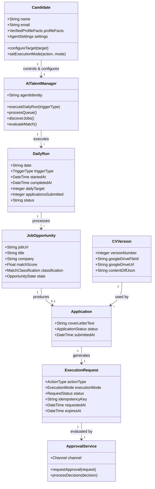

# Domain Model — ai-talent-manager

## Key Domain Concepts & Entities

### 1. Actors & Control Model
- **Candidate (System Owner)**: Authoritative source of verified career facts. Controls settings, sets daily application targets, and explicitly controls execution modes.
- **AI Talent Manager (Agent)**: Explicitly disclosed AI identity acting on behalf of candidate. Orchestrates daily runs, discovery, queueing, tailoring, and outreach without impersonating candidate or fabricating facts.

### 2. Execution Cycle & Quota Management
- **Daily Run**: Represents either the scheduled 10:00 AM execution cycle or a manual `Run Now` execution. Both use the same orchestrator and are distinguished by `trigger_type` for audit/testing.
- **Queue-First Loop**: A run processes existing qualifying opportunities first. If the queue cannot fill the remaining application slots, discovery adds candidates to the same queue. Processing repeats until the daily target is reached or qualifying work is exhausted.
- **Opportunity State Lifecycle**:
  `DISCOVERED` → `ELIGIBLE` → `QUEUED` → `SELECTED` → `APPROVAL_PENDING` → `APPROVED` → `SUBMITTING` → `SUBMITTED` / `REJECTED` / `FAILED_STALE`
  *(Note: `STRETCH` jobs are categorized, persisted, and logged for candidate insight rather than used to pad the daily application target.)*

### 3. Unified Execution & Approval Architecture
- **Action**: Any external side effect (`APPLICATION_SUBMISSION`, `RECRUITER_DM`, `LINKEDIN_POST`).
- **Execution Request**: Action wrapper that tracks `execution_mode` (`MANUAL` | `AUTONOMOUS`), status, idempotency protection, expiry where applicable, and decision history.
- **Execution Mode Settings**: Configurable independently per action type (`APPLICATION_EXECUTION_MODE`, `RECRUITER_DM_EXECUTION_MODE`, `LINKEDIN_POST_EXECUTION_MODE`). Defaults are `MANUAL` during initial validation.
- **Approval Service**: Channel-agnostic approval handler serving both Email action links and Next.js Dashboard. It is bypassed only for actions explicitly configured as `AUTONOMOUS`.
- **Security Control**: The AI Talent Manager cannot modify execution modes, permissions, security settings, or approval requirements.

### 4. Traceable Documents
- **CV Version**: Explicit version entity linking generated document, Google Drive file ID, content diff, and exact application submission record.

### 5. Control & Audit Guarantees
- Scheduled and manual triggers are operationally identical apart from `trigger_type`.
- Remaining daily capacity is calculated per run so the system does not over-select after partial completion.
- Qualifying opportunities not selected for the current run remain in the queue.
- Consequential actions are auditable through execution requests and approval events.
