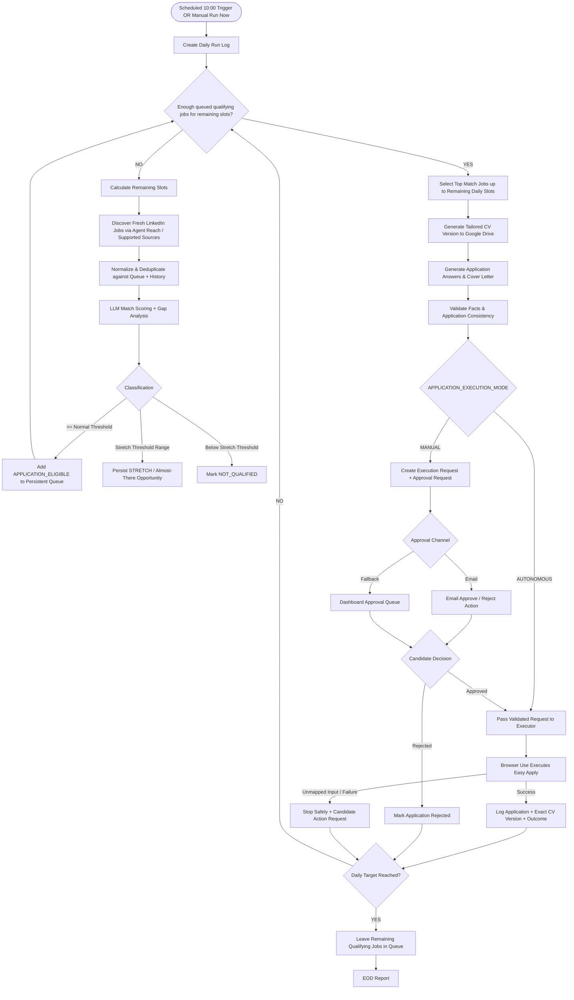
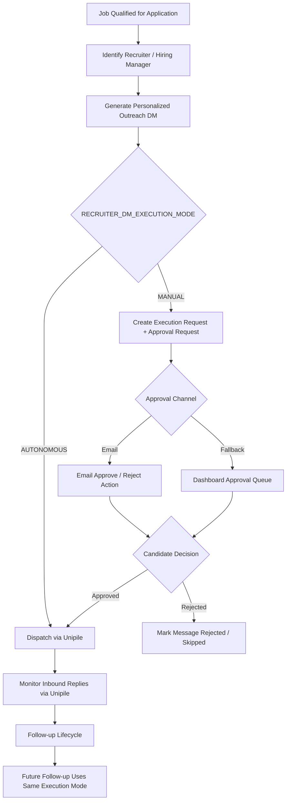
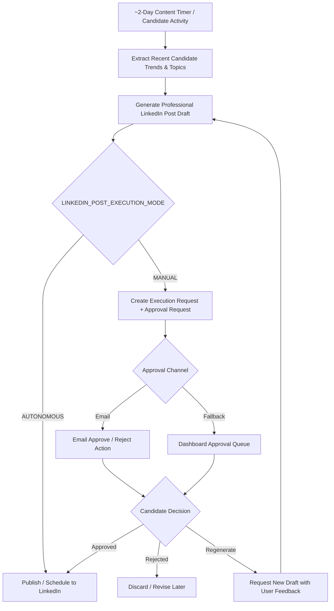

# User Flows — ai-talent-manager

## Journey 1: Daily Job Search & Application Flow

### Description
The daily cycle starts automatically at the configured time (default `10:00`) or manually through `Run Now`. Both entry points invoke the same Daily Run Orchestrator. The run processes the persistent opportunity queue first, discovers only when additional qualifying opportunities are required, repeatedly matches/tailors/processes applications until the daily target is reached, and preserves unused qualifying jobs for future runs.



### Run semantics
- The daily application target is configurable.
- The run counts **remaining slots**, not the full target, after applications have already been processed during that run.
- Discovery is conditional and occurs only when the queue cannot fill the remaining slots.
- The loop continues through discovery → match → queue → tailor → execution until the target is reached or no further qualifying work exists.
- Jobs discovered but not selected remain in the persistent queue.
- Stretch/almost-there jobs are retained for reporting/learning and are not automatically applied merely to satisfy the target.

## Journey 2: Recruiter Outreach & Relationship Tracking Flow

### Description
The agent identifies relevant recruiters, drafts personalized role-specific DMs, and routes dispatch through the same configurable execution architecture used for applications.



## Journey 3: LinkedIn Personal Branding Content Flow (~Every 2 Days)

### Description
Generates professional LinkedIn content based on candidate activity and approved themes. Publication uses the same execution-mode gate.



## Shared Approval Model

```text
Action
  ↓
Execution Request
  ↓
Execution Mode Gate
  ├── MANUAL → Approval Service → Email / Dashboard → Decision → Executor
  └── AUTONOMOUS → Validation → Executor
```

Email and Dashboard are two channels for the same approval record; they are not separate approval implementations.

## Decision Provenance
- **USER DECISION**: Daily Search, Application Execution, Recruiter Outreach, and LinkedIn Content are the core workflows.
- **USER DECISION**: Scheduled default is 10:00 AM and a manual `Run Now` trigger must use the same orchestrator.
- **USER DECISION**: Existing queue is processed first; discovery is conditional; the cycle repeats until the daily target is reached or qualifying work is exhausted.
- **USER DECISION**: Email approval is preferred where feasible, with Dashboard as fallback.
- **USER DECISION**: Application submission, recruiter DM dispatch, and LinkedIn publication each support independent `MANUAL` / `AUTONOMOUS` execution modes, initially `MANUAL`.
- **GROUNDED INFERENCE**: Fallback to manual assistance when Browser Use encounters unmapped application inputs.
