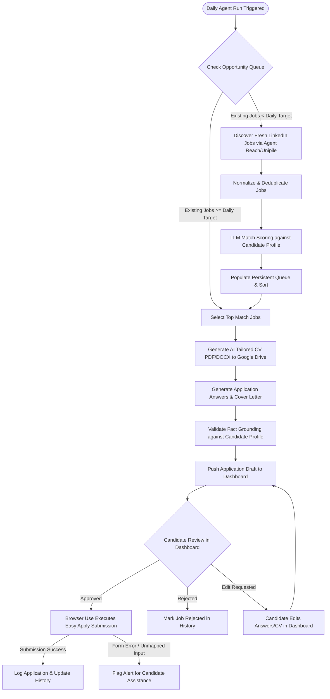
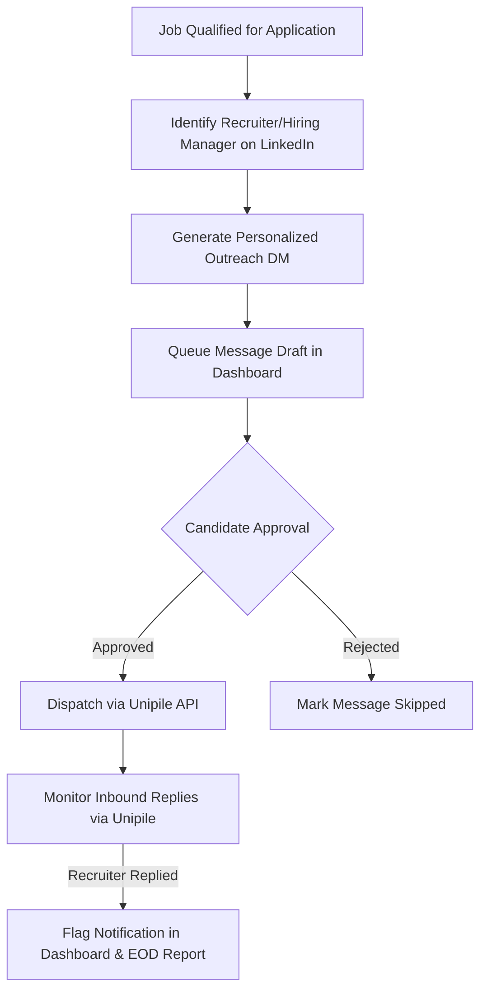
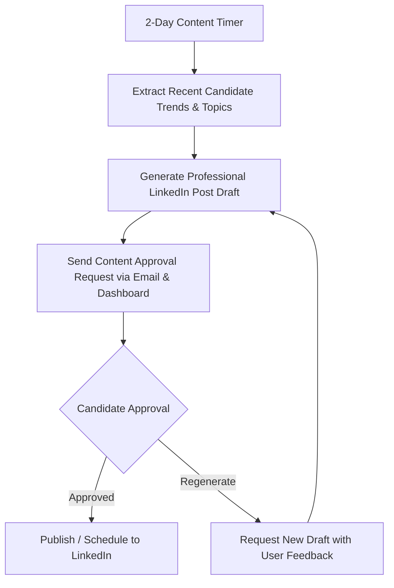

# User Flows — ai-talent-manager

## Journey 1: Daily Job Search & Application Flow

### Description
The core daily cycle where the agent evaluates queued/new jobs, generates tailored application materials, requests human approval, and submits applications via Browser Use.

---

## Journey 2: Recruiter Outreach & Relationship Tracking Flow

### Description
Identifies target recruiters at hiring companies, drafts role-specific DMs, requests approval, and dispatches messages via Unipile.

---

## Journey 3: LinkedIn Personal Branding Content Flow (~Every 2 Days)

### Description
Generates insightful professional LinkedIn post drafts based on candidate activity & industry topics for approval.

---

## Decision Provenance
- **USER DECISION**: 4 core workflows (Daily Search, Application Approval, Recruiter Outreach, LinkedIn Content).
- **GROUNDED INFERENCE**: Opportunity queue processed before discovering fresh jobs.
- **GROUNDED INFERENCE**: Fallback to manual assistance when Browser Use encounters unmapped application inputs.
